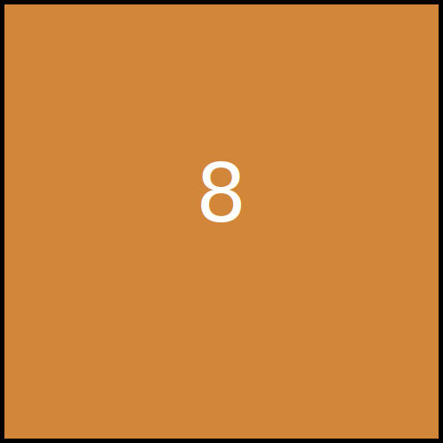

### Readme 2048 Game!

Click the links to submit an **issue** and start playing.

<!-- BEGIN CLICK-->

| Click List | Link                                                                                |
|------------|-------------------------------------------------------------------------------------|
| UP         | [Click TO UP](https://github.com/losehu/losehu/issues/new?body=UP&title=2048)       |
| DOWN       | [Click TO DOWN](https://github.com/losehu/losehu/issues/new?body=DOWN&title=2048)   |
| LEFT       | [Click TO LEFT](https://github.com/losehu/losehu/issues/new?body=LEFT&title=2048)   |
| RIGHT      | [Click TO RIGHT](https://github.com/losehu/losehu/issues/new?body=RIGHT&title=2048) |
| NEW GAME   | [START NEW GAME](https://github.com/losehu/losehu/issues/new?body=NEW&title=2048)   |

<!-- END CLICK -->

score: **20**
<!-- BEGIN CHESS BOARD -->

|  |  |  |  |
|-----------------------------------------|-----------------------------------------|-----------------------------------------|-----------------------------------------|
|  |  |  |  |
|  |  |  |  |
|  |  |  |  |

<!-- END CHESS BOARD -->

