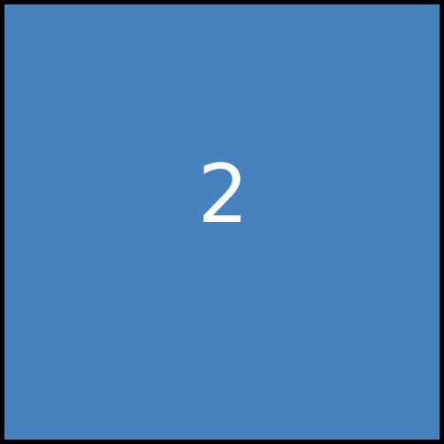

### Readme 2048 Game!

Click the links to submit an **issue** and start playing.

<!-- BEGIN CLICK-->

| Click List       | Link                                                                                |
|------------------|-------------------------------------------------------------------------------------|
| UP               | [Click TO UP](https://github.com/losehu/losehu/issues/new?body=UP&title=2048)       |
| DOWN             | [Click TO DOWN](https://github.com/losehu/losehu/issues/new?body=DOWN&title=2048)   |
| LEFT             | [Click TO LEFT](https://github.com/losehu/losehu/issues/new?body=LEFT&title=2048)   |
| RIGHT            | [Click TO RIGHT](https://github.com/losehu/losehu/issues/new?body=RIGHT&title=2048) |
|  NEW GAME | [START NEW GAME](https://github.com/losehu/losehu/issues/new?body=NEW&title=2048)   |

<!-- END CLICK -->

<!-- BEGIN CHESS BOARD -->

<!DOCTYPE html>
<html lang="en">
<head>
<meta charset="UTF-8">
<meta name="viewport" content="width=device-width, initial-scale=1.0">
<title>Grid Layout</title>

</head>
<body>

</body>
</html>

<!-- END CHESS BOARD -->

|||||
|--|--|--|--|
|||||
|||||
|||||
