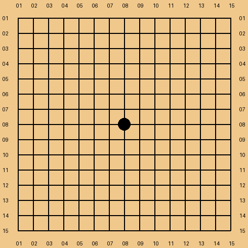

<!-- ### Hi there 👋
- 🔎   I’m currently researching panoramic understanding at the **[CV:PU Lab](https://yangkailun.com/team.html)**.
-  📔 My research involves areas such as mechanical engineering, automation, and computer vision. 
- 💗 If my project has been helpful to you, you can click the link below to donate me a cup of coffee. **[Here](https://losehu.github.io/payment-codes)**

Thank you very much to everyone who has helped me! **[Details](https://losehu.com/payment-codes/#%E6%89%93%E8%B5%8F%E5%90%8D%E5%8D%95)** -->
 

### Hi there 👋
This is a multiplayer Gomoku game implemented via GitHub profile README

* [**Click here**](https://github.com/losehu/losehu/issues/new?title=next%20step) enter row、column to play chess."

* For example, to play at row 5 column 8, enter **"5 8"**.

**White's** turn now.

<!-- flag -->
